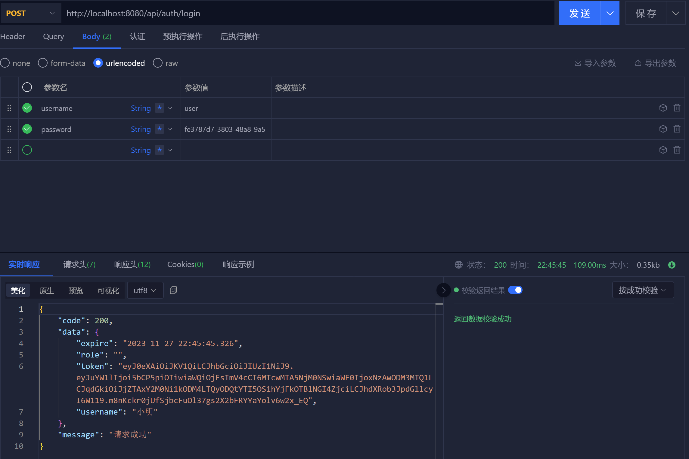

# My Website

```c#
/*
	@Author: CoderZijun
	@Emai: CodeZijun@163.com
	@Date: 2023-11-24
	@Tip:(启动项目前一定确认下面几点)
		Redis服务是否启动
		Mysql服务是否启动
		RabbitMQ消息队列是否启动？
		并检查配置文件端口是否配置正确
*/
```

## 项目需求

对需求文档进行整理

```yaml
办事大厅:
	教职工证明打印: 
		提供证明模板，读取职工信息生成打印文件即可
	电子调档函:
		提供调档函模板，填写相关信息生成对应文件即可
	社保管理:
		不了解，暂无
	个人信息:
		查询当前用户的详细个人信息
	网签合同:
		合同签订流程，需双方签字审批？？？暂无
师资信息:
	教职工资源目录:
		生成当前教职工的资源树展示在前端
	教职工信息数据管理:
		面向管理者，增删改查
	教职工信息上报助手:
		将表单导出即可
	教职工数据可视化:
		将表单可视化图表		
考核:
	当前职工上交考核报告，管理者进行评分（参照njtech教职工评价）
	年度考核:
	聘期考核:
	部门考核:
考勤:
	用户申请，管理者审批
	教职工请假:
	教职工出国:
	在职进修:
薪资:
	薪资表的CRUD，提供一个计算当前职工最后的总薪资的功能
	薪酬管理:
	绩效津贴:
分析:
	分析个鸡毛，可视化图表就行
	人资决策分析:
	高层次人才分析:
	专任教师分析:
报表:
	生成报表管理，管理者上传，用户能下载就行
    教育部高基统计报表:
    人社部人才资源统计报表:
人事:
	教职工招聘:
		提供一个门户界面，可申请表单，管理者审批
	人事移动:
		提供申请表单，管理者审批是否移动
	校外兼职管理:
		同招聘
	离退休管理:
		同人事移动
	新教职工注册报道:
		同人事移动
	文件制度:
		管理者编辑发布制度告示，在门户看见就行
后台:
	系统管控台:
		对对应角色进行CRUD就行，就是数据库可视化
#-----------------------------------------------------------------------------------------------------------------#
角色:
	管理员:
	用户:
		教职工:
			编制内:
			非编制:
		管理者:
```


## 基本项目配置

IDEA搭建Spring Boot + Vue 前后端分离项目

```yaml
# 基本结构
myWebSite:
	backend:
	frontend:
```

并结合 Spring Security 实现基本用户鉴权

本项目包地址使用默认配置 `com.example` 为根目录

## *Spring Security 基本配置

项目除`Spring Boot`的`yaml`配置，配置类均放于根目录的`config下`，`Security`配置类为`SecurityConfiguration`

```java
@Configuration
public class SecurityConfiguration {
    @Bean
    public SecurityFilterChain filterChain(HttpSecurity httpSecurity) throws Exception {
        return httpSecurity
                .authorizeHttpRequests(conf -> conf
                        .requestMatchers("/api/auth/**").permitAll() //放行该url下的api请求
                        .anyRequest().authenticated()                  //除放行请求外均要通过验证
                )
                .formLogin(conf -> conf
                        .loginProcessingUrl("/api/auth/login")         //配置登录接口url
                        .successHandler(this::onAuthenticationSuccess) //handler处理登录结果的响应
                        .failureHandler(this::onAuthenticationFailure)
                )
                .logout(conf -> conf
                        .logoutUrl("/api/auth/logout")        //配置注销接口url同理
                        .logoutSuccessHandler(this::onLogoutSuccess)
                )
                .csrf(AbstractHttpConfigurer::disable)         //取消csrf保护() 因为这里是自定义JWT令牌授权
                .sessionManagement(conf -> conf
                        .sessionCreationPolicy(SessionCreationPolicy.STATELESS)
                )                                               //JWT使用无状态，security不对session处理
                .build();
    }
    public void onAuthenticationSuccess(HttpServletRequest request,
                                        HttpServletResponse response,
                                        Authentication authentication) throws IOException, ServletException {
        response.setContentType("application/json;charset=utf-8");
        response.getWriter().write(RestBean.success().toJsonString());
    }

    public void onAuthenticationFailure(HttpServletRequest request,
                                        HttpServletResponse response,
                                        AuthenticationException exception) throws IOException, ServletException {
        response.setContentType("application/json;charset=utf-8");
        response.getWriter().write(RestBean.failure(401, exception.getMessage()).toJsonString());
    }

    public void onLogoutSuccess(HttpServletRequest request,
                                HttpServletResponse response,
                                Authentication authentication) throws IOException, ServletException {
        response.getWriter().write("Logout Success");
    }
}
```

以`json类型`封装了接口对前端`request` 响应返回数据，封装类为实体类`RestBean`，所有实体类位于根目录`entity`下

```Java
//这里封装为模板可以将任何数据直接当参数传入函数就可以以Json的格式返回给前端
public record RestBean<T>(int code, T data, String message) {
    public static <T> RestBean<T> success(T data) {
        return new RestBean<>(200, data, "请求成功");
    }

    public static <T> RestBean<T> success() {
        return success(null);
    }

    public static <T> RestBean<T> failure(int code, String message) {
        return new RestBean<>(code, null, message);
    }

    //封装一个方法 转化为json 使用alibaba的fastJson2
    public String toJsonString() {
        return JSONObject.toJSONString(this, JSONWriter.Feature.WriteNulls); //writeNulls指对空数据也会返回json 避免出问题
    }
}
```

其中使用的字符串转化为`Json`的转换工具为`fastJson2`，`Maven`依赖坐标如下

```xml
<dependency>
	<groupId>com.alibaba.fastjson2</groupId>
	<artifactId>fastjson2</artifactId>
 </dependency>
```

接口测试如下：

**成功登录**


**登录失败**


## Jwt 权限校验

> JWT 为 Java Web Token，用于作为Json对象在网络上安全地传递信息。
>
> 对于Web开发，可以很好地用在Authorization（授权）并实现单点登录。
>
> JWT 结构为 Header.Payload.Signature

```yaml
Header:
	典型地由两部分组成：Token类型 + 算法名称
	{
		'alg': "HS256",
		'typ': "JWT"
	}
Payload:
	这部分包含声明，里面可以存放传输所需的一些信息
	{
		"sub": '123123123',
		"name": 'codezijun',
		"remember": true
	}
Signature:
	这部分是由私钥生成的签名，保证JWT唯一且未被更改
```

**`Token`是无状态的，只由服务端赋予客户端，然后之后都由客户端在`Header`中携带`JWT`返回由服务端校验**

### 发布Jwt令牌

#### 创建Jwt令牌

`Java Jwt`框架依赖坐标

```xml
<dependency>
	<groupId>com.auth0</groupId>
	<artifactId>java-jwt</artifactId>
	<version>4.3.0</version>
</dependency>
```

既然要发布`Jwt令牌`，就要先有`Jwt令牌`，逻辑的第一步也就时创建`Jwt令牌`。

为了实现单点登录的需求，且为了方便前端校验数据，我们需要将必要的信息写入`Token`中，并且设定过期时间等，最后再进行签名完成`Jwt令牌`的创建。

```Java
//这里在根目录创建工具模块utils
//实现Jwt工具类 JwtUtils

@Component
public class JwtUtils {
    @Value("${spring.security.jwt.key}")
    String key;

    @Value("${spring.security.jwt.expire}")
    int expire;
    
    public String createJwt(UserDetails details, int id, String username) {
        Algorithm algorithm = Algorithm.HMAC256(key);
        Date expire = this.expireTime();
        return JWT.create()
                .withClaim("id", id)
                .withClaim("name", username)
                //将用户的权限列表作为声明添加到JWT中。这里使用`details.getAuthorities()`获取用户的权限信息，然后将权限名称提取出来并转换为列表。
                .withClaim("authorities", details.getAuthorities().stream().map(GrantedAuthority::getAuthority).toList())
                //过期时间
                .withExpiresAt(expire)
                //token颁发时间
                .withIssuedAt(new Date())
                //最后用算法签名
                .sign(algorithm);
    }

    //计算过期的目标时间
    public Date expireTime() {
        Calendar calendar = Calendar.getInstance();        //获取当前时间
        calendar.add(Calendar.HOUR, expire * 24);   //加上expire * 24 小时后为过期时间
        return  calendar.getTime();
    }
}
```

其中`expire`和`key`的配置均在`application.yml`中

```yaml
# main/resource/application.yml
spring:
  security:
    jwt:
      key: coderzijunNB
      expire: 3
```

#### 颁发Jwt令牌

之前说过为了方便我们会向前端返回一些比较有用的信息（包括`token`）在此我们创建如下文件结构：

```yaml
#其中，数据库这一层的对象封装在dto，与前端进行数据交互的封装在vo，并进一步分为request和response两种
com.example:
	entity:
		dto:
		vo:
			request:
			response:
```

我们要实现的是后端对前端的`response`，也就是对用户信息登录的响应，封装为`AuthorizeVO`如下：

```java
// entity/vo/response/AuthorizeVO
// 其中包含token和过期时间expire
@Data
public class AuthorizeVO {
    String username;
    String role;
    String token;
    Date expire;
}
```

在之前在登录接口中对成功登录的响应中，我们只返回了成功信息，现在我们在其中加入`Jwt令牌`的颁发。

```Java
//进一步完善SecurityConfiguration类下onAuthoriztionSuccess方法
//这里没有调用数据库先把部分信息写死
public void onAuthenticationSuccess(HttpServletRequest request,
                                    HttpServletResponse response,
                                    Authentication authentication) throws IOException {
    response.setContentType("application/json;charset=utf-8");
    //获取用户详细信息 Security的User，这个User是security的User
    User user = (User) authentication.getPrincipal();
    //创建令牌
    String token = jwtUtils.createJwt(user, 1, "小明");
    AuthorizeVO vo = new AuthorizeVO();
    //颁发令牌
    vo.setExpire(jwtUtils.expireTime());
    vo.setRole("");
    vo.setToken(token);
    vo.setUsername("小明");
    response.getWriter().write(RestBean.success(vo).toJsonString());
}
```

### Jwt请求头校验

要实现`Jwt`请求头校验，需要在`Security`实现的过滤器链中加入自定义的`Jwt校验过滤器`，来实现`Jwt`的检验解析

创建`filter目录`存放所有的过滤器，创建`JwtAuthorizeFilter`类，继承`OncePerRequestFilter`，实现如下:

```java
//这里创建的过滤器是为了在Security实现的过滤器链中加入我们自定义的过滤器 实现JWT的校验解析
@Component
public class JwtAuthorizeFilter extends OncePerRequestFilter {
    @Resource
    JwtUtils jwtUtils;
    @Override
    protected void doFilterInternal(HttpServletRequest request,
                                    HttpServletResponse response,
                                    FilterChain filterChain) throws ServletException, IOException {
        //读取请求头中的校验参数 里面携带token(前缀为"Bearer "),并校验合法性
        String authorization = request.getHeader("Authorization");
        DecodedJWT jwt = jwtUtils.resolveJwt(authorization);
        if(jwt != null) {
            UserDetails user = jwtUtils.toUser(jwt);
            UsernamePasswordAuthenticationToken authenticationToken =
                    new UsernamePasswordAuthenticationToken(user, null, user.getAuthorities());
            authenticationToken.setDetails(new WebAuthenticationDetailsSource().buildDetails(request));
            SecurityContextHolder.getContext().setAuthentication(authenticationToken);
            request.setAttribute("id", jwtUtils.toId(jwt));
        }
        //进行过滤器链的下一个节点
        filterChain.doFilter(request, response);
    }
}

//然后在之前实现的filterChain中注册该过滤器
@Resource
JwtAuthorizeFilter jwtAuthorizeFilter
.addFilterBefore(jwtAuthorizeFilter, UsernamePasswordAuthenticationFilter.class)
    
//处理无权限的响应
    .exceptionHandling(conf -> conf                     //无权限
                       .authenticationEntryPoint(this::onUnauthorized)
                       .accessDeniedHandler(this::onAccessDeny)
                      )
//登录的但是没权限 403
 public void onAccessDeny(HttpServletRequest request,
                             HttpServletResponse response,
                             AccessDeniedException exception) throws IOException {
    response.setContentType("application/json;charset=utf-8");
    response.getWriter().write(RestBean.forbidden(exception.getMessage()).toJsonString());
}

//未验证的情况处理
public void onUnauthorized(HttpServletRequest request,
                           HttpServletResponse response,
                           AuthenticationException exception) throws IOException {
    response.setContentType("application/json;charset=utf-8");
    response.getWriter().write(RestBean.unauthorized(exception.getMessage()).toJsonString());
}
```

并且在`RestBean`中封装对应的响应返回

```Java
//401
public static <T> RestBean<T> unauthorized(String message) {
    return failure(401, message);
}

//403
public static <T> RestBean<T> forbidden(String message) {
    return failure(403, message);
}
```

完成请求头的校验

### Jwt注销登录

在用户注销登录后，相应的应将`token`丢弃，为了安全，应该将`token`失效后再丢弃。这里配合`Redis`实现黑名单注销`token`\

`Redis依赖坐标`

```xml
<dependency>
    <groupId>org.springframework.boot</groupId>
    <artifactId>spring-boot-starter-data-redis</artifactId>
</dependency>
```

拉黑的逻辑比较简单，只需要向`token`内写入一个`id`，之后根据这个`id`存入`Redis`即完成拉黑

在工具包内创建`Const`类存放常量

```Java
package com.example.utils;

//存储常量
public class Const {
    public static final String JWT_BLACK_LIST = "jwt:blacklist:";
}

```

在`JwtUtils`内写入以下逻辑

```Java
@Resource
StringRedisTemplate template;
//返回是否失效
public boolean invalidJwt(String headerToken) {
    //无效token
    String token = this.convertToken(headerToken);
    if (token == null) return false;
    Algorithm algorithm = Algorithm.HMAC256(key);
    JWTVerifier jwtVerifier = JWT.require(algorithm).build();
    try {
        DecodedJWT jwt = jwtVerifier.verify(token);
        String id = jwt.getId();
        return deleteToken(id, jwt.getExpiresAt());
    } catch (JWTVerificationException e) {
        return false;
    }
}
//拉黑token
private boolean deleteToken(String uuid, Date time) {
    if(this.isInvalidToken(uuid))
        return false;
    Date now = new Date();
    //计算过期剩余时间
    long expire = Math.max(time.getTime() - now.getTime(), 0);
    //存入Redis做到拉黑,后面参数指毫秒
    template.opsForValue().set(Const.JWT_BLACK_LIST + uuid, "", expire, TimeUnit.MILLISECONDS);
    return true;
}

//令牌是否失效
private boolean isInvalidToken(String uuid) {
    return Boolean.TRUE.equals(template.hasKey(Const.JWT_BLACK_LIST + uuid));
}

//在之前的创建令牌方法中要加入JWTid作为存放Redis的依据
.withJWTId(UUID.randomUUID().toString())
```

最后在登出`api`中实现逻辑

```java
public void onLogoutSuccess(HttpServletRequest request,
                            HttpServletResponse response,
                            Authentication authentication) throws IOException, ServletException {
    response.setContentType("application/json;charset=utf-8");
    PrintWriter writer = response.getWriter();
    String authorization = request.getHeader("Authorization");
    if(jwtUtils.invalidJwt(authorization)) {
        writer.write(RestBean.success().toJsonString());
    } else {
        writer.write(RestBean.failure(400, "退出失败").toJsonString());
    }
}
```

测试接口如下：




完成Jwt登录退出

## 数据库校验

取代`Security`验证自带的用户，使用自己的数据库完成用户校验

`mybatis-plus依赖坐标`

```xml
<dependency>
    <groupId>com.baomidou</groupId>
    <artifactId>mybatis-plus-boot-starter</artifactId>
    <version>3.5.3.1</version>
</dependency>
```

***踩坑** `Spring Boot version3.2.0使用 @Mapper 创建 mapper 和 实体类的映射报错导致项目启动失败，降低版本至3.1.2报错解决`

创建`DTO`实体类`Account MyBatis-Plus`要注明联系表及主键

```java
@Data
@TableName("db_account")
@AllArgsConstructor
public class Account {
    @TableId(type = IdType.AUTO)
    Integer id;
    String username;
    String password;
    String email;
    String role;
    Date registerTime;
}
```

创建`Mapper`映射，`Mapper`映射均存放根目录`Mapper`包内

```Java
//mapper/AccountMapper
//mybatisplus映射要继承基映射并指明类型

@Mapper
public interface AccountMapper extends BaseMapper<Account> {
}

```

创建`service`做数据库校验，`service`服务均存放根目录`service`包内，同时其实现类均存放`service/impl`下，创建`AccountService`

```Java
//mybatisplus的基本配置实现接口需继承IService使用CRUD接口，继承UserDetailsService覆盖Security自带的检验规则
public interface AccountService extends IService<Account>, UserDetailsService {
    Account findByNameOrEmail(String text);
}
```

实现接口实现类`AccountServiceImpl`

```Java
//实现最基本的查询操作
//注：这里可以根据邮箱或用户名进行登录，其中username仅代表Security的User属性，不一定是用户名，不可当用户名传输
@Service
public class AccountServiceImpl extends ServiceImpl<AccountMapper, Account> implements AccountService {
    @Override
    public UserDetails loadUserByUsername(String username) throws UsernameNotFoundException {
        Account account = findByNameOrEmail(username);
        if(account == null)
            throw new UsernameNotFoundException("用户名或密码错误");
        return User
                .withUsername(username)
                .password(account.getPassword())
                .roles(account.getRole())
                .build();
    }

    public Account findByNameOrEmail(String text) {
        return this.query()
                .eq("username", text).or()
                .eq("email", text)
                .one();
    }
}
```

最后重写`SecurityConfiguration`内的`onAuthenticationSuccess`中写死部分

```java
public void onAuthenticationSuccess(HttpServletRequest request,
                                    HttpServletResponse response,
                                    Authentication authentication) throws IOException {
    response.setContentType("application/json;charset=utf-8");
    //获取用户详细信息 Security的User
    User user = (User) authentication.getPrincipal();
    Account account = service.findByNameOrEmail(user.getUsername());
    String token = jwtUtils.createJwt(user, account.getId(), account.getUsername());
    AuthorizeVO vo = new AuthorizeVO();
    vo.setExpire(jwtUtils.expireTime());
    vo.setRole(account.getRole());
    vo.setToken(token);
    vo.setUsername(account.getUsername());
    response.getWriter().write(RestBean.success(vo).toJsonString());
}
```

完成数据库校验

## 登录页面

### 基础登录页面

使用`element-plus`辅助布局，[一个 Vue 3 UI 框架 | Element Plus (element-plus.org)](https://element-plus.org/zh-CN/)

```shell
npm install vue-router
npm install element-plus --save
npm install -D unplugin-vue-components unplugin-auto-import

#关于ElementPlus按需导入插件，需在vite.config.js的plugins中添加
AutoImport({
	resolvers: [ElementPlusResolver()],
}),
Components({
	resolvers: [ElementPlusResolver()],
}),

# 关于icon图标，直接引入后会提示安装依赖，直接安装即可
import { User, Lock } from '@element-plus/icons-vue'

# index.html下导入css样式
<link rel="stylesheet" href="//unpkg.com/element-plus/dist/index.css" />

# main.js下导入
import 'element-plus/theme-chalk/dark/css-vars.css'
```

实现预期效果如下，后期可进行完善


### 封装异步请求

```shell
# 安装Axios
npm install axios
```

在根目录下的`main.js`中修改后端`ip`

```js
axios.defaults.baseURL = 'http://localhost:8080'
```

在根目录下创建`net/index.js`来处理网络交互

```js
const authItemName = "access_token"

//首先我们封装内部使用的Get，Psot请求
//内部的Post Axios封装
function internalPost(url, data, header, success, failure, error = defaultError) {
    axios.post(url, data,{headers: header}).then(({data}) => {
        if(data.code === 200) {
            success(data.data)
        } else {
            failure(data.message, data.code, data.url)
        }
    }).catch(err => error(err))
}

//内部的Get Axios封装
function internalGet(url, header, success, failure, error = defaultError) {
    axios.get(url, {headers: header}).then(({data}) => {
        if (data.code === 200) {
            success(data.data)
        } else {
            failure(data.message, data.code, url)
        }
    }).catch(err => error(err))
}
//同时我们的登录页面是基于Jwt的，因此前端需要对后端接口传输过来的Jwt进行本地储存，这里实现对Jwt的一些处理函数
//读取token
function takeAccessToken() {
    const str = localStorage.getItem(authItemName) || sessionStorage.getItem(authItemName)
    if(!str) return null;
    //把字符串加工回Json对象
    const authObj = JSON.parse(str)
    if(authObj.expire <= new Date()) {
        deleteAccessToken()
        ElMessage.warning('登录状态已过期，请重新登录')
        return null
    }
    return authObj.token
}

//前端保存Token
function storeAccessToken(token, remember, expire) {
    const authObj = {
        token: token,
        expire: expire
    }
    const str = JSON.stringify(authObj)
    if(remember)
        localStorage.setItem(authItemName, str)
    else
        sessionStorage.setItem(authItemName, str)
}

function deleteAccessToken() {
    localStorage.removeItem(authItemName)
    sessionStorage.removeItem(authItemName)
}

const defaultFailure = (message, code, url) => {
    console.warn(`请求地址: ${url}, 状态码: ${code}, 错误信息: ${message}`)
    ElMessage.warning(message)
}

const defaultError = (err) => {
    console.log(err)
    ElMessage.warning('发生了一些错误，请联系管理员')
}
```

最后实现一下基本的登录方法`login`

```js
function login(username, password, remember, success, failure = defaultFailure) {
    internalPost('/api/auth/login', {
        username: username,
        password: password
    }, {
        //axios默认为json传输，Security只支持form表单登录，这里改变类型为表单
        'Content-Type': 'application/x-www-form-urlencoded'
    }, (data) => {
        storeAccessToken(data.token, remember, data.expire)
        ElMessage.success(`登录成功，欢迎+${username}`)
        success(data)
    }, failure)
}

export {login}
```

### 表单校验并发送请求


```vue
<script setup>
import {reactive, ref} from "vue";
//标记表单为响应式，后面会调用
const formRef = ref()
//响应式表单数据
const form = reactive({
  username: '',
  password: '',
  remember: false
})
//创建表单校验规则
const rule = {
  username: [
    {required: true, message: "请输入用户名"}
  ],
  password: [
    {required: true, message: "请输入密码"}
  ]
}
//登录函数再封装实现最终的登录请求
function userLogin() {
  formRef.value.validate((valid) => {
    if(valid) {
      login(form.username, form.password, form.remember, () => {})
    }
  })
}
</script>

<template>
	<!--板顶表单对应的响应式变量对象，并标注为响应式用于获取value-->
	<el-form :model="form" :rules="rule" ref="formRef">
        <!--prop属性是为了对应校验规则中的属性，否则校验无法生效-->
        <el-form-item prop="username">
          <el-input v-model="form.username" maxlength="15" type="text" placeholder="用户名/邮箱">
            <template #prefix>
              <el-icon><User /></el-icon>
            </template>
          </el-input>
        </el-form-item>
		<!--prop属性是为了对应校验规则中的属性，否则校验无法生效-->
        <el-form-item prop="password">
          <el-input v-model="form.password" type="password" placeholder="请输入密码">
            <template #prefix>
              <el-icon><Lock /></el-icon>
            </template>
          </el-input>
        </el-form-item>
	</el-form>
	<!--调用登录函数-->
    <div style="margin-top: 40px">
      <el-button @click="userLogin" style="width: 270px" type="success" plain>立即登录</el-button>
    </div>
</template>
```

## 解决跨域问题

跨域问题是因为一些安全机制为了抵抗部分网络攻击而指定的保护措施产生的，就是只允许访问本`IP和端口`下的资源

报错如下:


只需在后端添加一个解决跨域的拦截器，让他对我们前端的请求中写入一些跨域的信息

`filter/CorsFilter`

```Java
@Component
@Order(Const.ORDER_CORS)
public class CorsFilter extends HttpFilter {
    @Override
    protected void doFilter(HttpServletRequest request,
                            HttpServletResponse response,
                            FilterChain chain) throws IOException, ServletException {
        this.addCorsHeader(request, response);
        //所有请求直接放行就行，只需要在response加跨域信息
        chain.doFilter(request, response);
    }

    public void addCorsHeader(HttpServletRequest request,
                              HttpServletResponse response) {
        response.addHeader("Access-Control-Allow-Origin", request.getHeader("Origin"));
        response.addHeader("Access-Control-Allow-Methods", "GET, POST, PUT, DELETE, OPTIONS");
        response.addHeader("Access-Control-Allow-Headers", "Authorization, Content-Type");
    }
}

//在Const常量中添加
public static final int ORDER_CORS = -102 ;
```

### 退出登录

#### 函数实现

退出登录的实现就是调用后端接口后，在前端将客户端`Token`删除然后页面跳转至登录界面

```js
function logout(success, failure = defaultFailure) {
    get("/api/auth/logout", () => {
        deleteAccessToken()
        ElMessage.success('已退出登录')
        success()
    }, failure)
}

function unauthorized() {
    return !takeAccessToken()
}

//获取本地Token
function takeAccessToken() {
    const str = localStorage.getItem(authItemName) || sessionStorage.getItem(authItemName)
    if(!str) return null;
    const authObj = JSON.parse(str)
    if(authObj.expire <= new Date()) {
        deleteAccessToken()
        ElMessage.warning('登录状态已过期，请重新登录')
        return null
    }
    return authObj.token
}

//获取请求头, 后续操作都需要请求头
function accessHeader() {
    const token = takeAccessToken()
    return token ? { 'Authorization': `Bearer ${takeAccessToken()}`} : {}
}
//封装请求头至方法中可以直接使用
function get(url, success, failure = defaultFailure) {
    internalGet(url, accessHeader(), success, failure)
}
```

功能实现

```vue
<script setup>
import {logout} from "@/net";
import router from "@/router";

function userLogout() {
  logout(() => router.push('/'))
}
</script>

<template>
  <div>
    <el-button @click="userLogout">退出登录</el-button>
  </div>
</template>

<style scoped>

</style>

<!-- 并且将login的success回调函数加入到index页面的跳转 -->
```

#### 路由守卫

解决可直接通过路由进入无权限的页面`router.js`

```js
//配置路由
const router = createRouter({
    history: createWebHistory(import.meta.env.BASE_URL),
    routes: [
        {
            path: '/',
            name: 'welcome',
            component: () => import('@/views/WelcomeView.vue'),
            children: [
                {
                    path: '',
                    name: 'welcome-login',
                    component: () => import('@/views/welcome/LoginPage.vue')
                }
            ]
        }, {
            path: '/index',
            name: 'index',
            component: () => import('@/views/IndexView.vue')
        }
    ]
})

router.beforeEach((to, from, next) => {
    const isUnauthorized = unauthorized()
    if(to.name.startsWith('welcome-') && !isUnauthorized) {
        next('/index')
    } else if (to.fullPath.startsWith('/index') && isUnauthorized){
        next('/')
    } else {
        next()
    }
})
```

## 后端发送验证邮件

```xml
<!-- 依赖 邮件和消息队列-->
<dependency>
    <groupId>org.springframework.boot</groupId>
    <artifactId>spring-boot-starter-mail</artifactId>
</dependency>
<dependency>
    <groupId>org.springframework.boot</groupId>
    <artifactId>spring-boot-starter-amqp</artifactId>
</dependency>
```

```yml
# 邮件和消息队列配置
spring:
	mail:
		host: smtp.163.com
		username:
		password:
	rabbitmq:
		addresses: localhost
		username: guest
		passward: guest
```

**配置消息队列**

创建配置类`config/RabbitConfiguration`

```java
@Configuration
public class RabbitConfiguration {
    @Bean("emailQueue")
    public Queue emailQueue() {
        return QueueBuilder.durable("mail").build();
    }
}
```

在`AccountService`接口类中添加方法`registerEmailVerifyCode`

```Java
 String registerEmailVerifyCode(String type, String email, String ip);
```

在其对应实现类中实现`impl/AccountServiceImpl`

```java
@Resource
FlowUtils flowUtils;

@Resource
AmqpTemplate amqpTemplate;

@Resource
StringRedisTemplate stringRedisTemplate;

@Override
public String registerEmailVerifyCode(String type, String email, String ip) {
    //加锁防止同一时间过多请求
    synchronized (ip.intern()) {
        if (!this.verifyLimit(ip)) {
            return "请求频繁，请稍后再试";
        }
        //生成六位验证码
        Random random = new Random();
        int code = random.nextInt(899999) + 100000;
        Map<String, Object> data  = Map.of("type", type, "email", email, "code", code);
        amqpTemplate.convertAndSend("mail", data);
        stringRedisTemplate.opsForValue()
            .set(Const.VERIFY_EMAIL_DATA + email, String.valueOf(code), 3, TimeUnit.MINUTES);

        return null;
    }
}

private boolean verifyLimit(String ip) {
    String key = Const.VERIFY_EMAIL_LIMIT + ip;
    return flowUtils.limitOnceCheck(key, 60);
}
```

`Const`内加入相关的常量

```java
public static final String VERIFY_EMAIL_LIMIT = "verify:email:limit:";
public static final String VERIFY_EMAIL_DATA = "verify:email:data:";
```

`FlowUtils`工具类实现工具方法

```java
//基本逻辑就是检查某ip是否在请求发送邮件的冷却期内，如果存在就返回0，不存在就使其CD并返回1```````````
@Component
public class FlowUtils {
    @Resource
    StringRedisTemplate template;
    public boolean limitOnceCheck(String key, int blockTime) {
        if (Boolean.TRUE.equals(template.hasKey(key))) {
            return false;
        } else {
            template.opsForValue().set(key, "", blockTime, TimeUnit.SECONDS);
            return true;    
        }
    }
}
```

**添加消息队列监听器作为消费者来发送邮件**

`listener/MailQueueListener`

```java
@Component
@RabbitListener(queues = "mail")
public class MailQueueListener {

    @Resource
    JavaMailSender sender;

    @Value("${spring.mail.username}")
    String username;

    @RabbitHandler
    public void sendMailMessage(Map<String, Object> data) {
        String email = (String) data.get("email");
        Integer code = (Integer) data.get("code");
        String type = (String) data.get("type");
        SimpleMailMessage message = switch (type) {
            case "register" ->
                    createMessage("欢迎注册MyWebSite",
                            "您的邮件注册码为：" + code + "有效时间3分钟， 为了你的账号安全，请勿向他人泄露验证码信息！", email);
            case "reset" ->
                    createMessage("MyWebSite密码重置",
                            "您正在进行密码重置操作，验证码：" + code + "，有效时间3分钟，如非本人操作请无视！",email);
            default -> null;
        };
        if (message == null)
            return;
        sender.send(message);
    }

    private SimpleMailMessage createMessage(String title, String content, String email) {
        SimpleMailMessage message = new SimpleMailMessage();
        message.setSubject(title);
        message.setText(content);
        message.setTo(email);
        message.setFrom(username);
        return message;
    }
}
```

**在Controller层创造接口**

`controller/AuthorizeController`

```java
@RestController
@RequestMapping("/api/auth")
public class AuthorizeController {

    @Resource
    AccountService service;
    @GetMapping("/ask-code")
    public RestBean<Void> askVerifyCode(@RequestParam String email,
                                        @RequestParam String type,
                                        HttpServletRequest request) {
        String message = service.registerEmailVerifyCode(type, email, request.getRemoteAddr());
        return message == null ? RestBean.success() : RestBean.failure(400, message);
    }
}
```

## 注册接口

### 请求参数校验

我们在向接口发送请求的时候，为了安全起见，请求所携带的参数需要被校验限制，不然用户可以提交非法请求参数导致后端邮箱发送失败，引起消息队列消费者持续报错，对服务端有安全威胁！导入依赖后只需要通过相应注解即可完成校验。

```xml
<!-- 导入依赖 -->
<dependency>
    <groupId>org.springframework.boot</groupId>
    <artifactId>spring-boot-starter-validation</artifactId>
</dependency>
```

在`Controller`层处理对请求参数的检验返回的`exception`，处理类为`controller/exception/ValidationController`

```java
//使用SpringBoot同样的Slf4j日志打印，并保持和SpringBoot日志输出格式一致
@Slf4j
@RestControllerAdvice
public class ValidationController {
    @ExceptionHandler(ValidationException.class)
    public RestBean<Void> validateException(ValidationException exception) {
        log.warn("Resolve [{}: {}]", exception.getClass().getName(), exception.getMessage());
        return RestBean.failure(400, "请求参数有误");
    }
}
```

对`/ask-code`接口检验

```java
@GetMapping("/ask-code")
public RestBean<Void> askVerifyCode(@RequestParam @Email String email,
                                    @RequestParam @Pattern(regexp = "(register | reset)") String type,
                                    HttpServletRequest request) {
    return this.messageHandle(() -> service.registerEmailVerifyCode(type, email, request.getRemoteAddr()));
}
```

封装请求数据的实体类`EmailRegisterVO`，并对数据进行校验，前端数据均可封装为此实体类进行请求

```java
@Data
public class EmailRegisterVO {
    @Email
    String email;
    @Length(max = 6, min = 6)
    String code;
    //用户名不可包含非法字符
    @Pattern(regexp = "^[a-zA-Z0-9\\u4e00-\\u9fa5]+$")
            @Length(min = 1, max = 15)
    String username;
    @Length(min = 6, max = 20)
    String password;
}
```

在`Service`层实现邮箱注册方法

接口设计方法`AccountService`

```java
String registerEmailAccount(EmailRegisterVO vo);
```

具体实现`AcountServiceImpl`中的邮箱注册方法

```java
@Override
public String registerEmailAccount(EmailRegisterVO vo) {
    String email = vo.getEmail();
    String username = vo.getUsername();
    String key = Const.VERIFY_EMAIL_DATA + email;
    String code = stringRedisTemplate.opsForValue().get(key);
    if (code == null) return "请先获取验证码";
    if (!code.equals(vo.getCode())) return "验证码输入错误，请重新输入";
    if (this.existsAccountByEmail(email)) return "此电子邮箱已被注册！";
    if (this.existsAccountByUsername(username)) return "此用户名已被注册！";
    String password = encoder.encode(vo.getPassword());
    Account account = new Account(null, username, password, email, "user", new Date());
    if (this.save(account)) {
        stringRedisTemplate.delete(key);
        return null;
    } else {
        return "内部错误，请联系管理员";
    }
}

private boolean existsAccountByEmail(String email) {
    return this.baseMapper.exists(Wrappers.<Account>query().eq("email", email));
}

private boolean existsAccountByUsername(String username) {
    return this.baseMapper.exists(Wrappers.<Account>query().eq("username", username));
}
```

在处理用户认证的`Controller`层`controller/AuthorizeController`中实现注册接口

```java
//Post接收JSON格式
@PostMapping("/register")
public RestBean<Void> register(@RequestBody @Valid EmailRegisterVO vo) {
    return this.messageHandle(() -> service.registerEmailAccount(vo));
}

private RestBean<Void> messageHandle(Supplier<String> action) {
    String message = action.get();
    return message == null ? RestBean.success() : RestBean.failure(400, message);
}
```

对于数据处理格式，因为`Axios`返回的为`JSON`，所以我习惯使用`POST`传输`JSON`格式数据，习惯对`GET`以参数传输交互数据

### 接口测试

获取验证码


使用验证码注册


成功注册！


成功登录！


其他错误测试均生效

## 注册页面

创建注册组件`RegisterPage`

```vue
<script setup>
import {reactive} from "vue";
import {Lock, Message, Promotion, User} from "@element-plus/icons-vue";
import router from "@/router";

const form = reactive({
  username: '',
  password: '',
  password_repeat: '',
  email: '',
  code: ''
})

const rule = {

}
</script>

<template>
  <div style="text-align: center; margin: 0 20px">
    <div style="margin-top: 150px">
      <div style="font-size: 25px; font-weight: bold">注册新用户</div>
      <div style="font-size: 14px; color: grey">请填写下列信息进行注册</div>
    </div>

    <div style="margin-top: 50px;">
      <el-form :model="form" :rules="rule">
        <el-form-item>
          <el-input v-model="form.username" maxlength="20" type="text" placeholder="用户名">
            <template #prefix>
              <el-icon><User /></el-icon>
            </template>
          </el-input>
        </el-form-item>

        <el-form-item>
          <el-input v-model="form.password" maxlength="20" type="password" placeholder="请输入密码">
            <template #prefix>
              <el-icon><Lock /></el-icon>
            </template>
          </el-input>
        </el-form-item>

        <el-form-item>
          <el-input v-model="form.password_repeat" maxlength="20" type="password" placeholder="请确认你的密码">
            <template #prefix>
              <el-icon><Lock /></el-icon>
            </template>
          </el-input>
        </el-form-item>

        <el-form-item>
          <el-input v-model="form.email" maxlength="20" type="text" placeholder="请输入邮箱">
            <template #prefix>
              <el-icon><Message /></el-icon>
            </template>
          </el-input>
        </el-form-item>

        <el-form-item>
          <el-row :gutter="10" style="width: 100%;">
            <el-col :span="15">
              <el-input v-model="form.code" minlength="6" maxlength="6" type="text" placeholder="请输入验证码">
                <template #prefix>
                  <el-icon><Promotion /></el-icon>
                </template>
              </el-input>
            </el-col>
            <el-col :span="9">
              <el-button type="primary" style="width: 120px" plain>获取验证码</el-button>
            </el-col>
          </el-row>
        </el-form-item>
      </el-form>
    </div>

    <div style="margin-top: 60px">
      <el-button type="success" style="width: 300px">立即注册</el-button>
    </div>

    <div style="margin-top: 20px">
      <el-divider>
        <span style="font-size: 13px; color: grey">已有账号？</span>
      </el-divider>
      <el-link @click="router.push('/')">点我立即登录</el-link>
    </div>
  </div>
</template>

<style scoped>

</style>
```

配置路由

```js
{
    path: "/register",
    name: 'welcome-register',
           component: () => import("@/views/welcome/ResgisterPage.vue")
}
```

在登录页实现对注册组件的跳转`@click=router.push('register')`

`WelcomeView`实现淡入淡出跳转

```vue
<router-view v-slot="{ Component }">
    <transition name="el-fade-in-linear" mode="out-in">
        <component :is="Component"/>
    </transition>
</router-view>
```

`form表单加入校验规则`

```js
const isEmailValid = computed(() => /^[\w.-]+@[\w.-]+\.\w+$/.test(form.email))

const validateUsername = (rule, value, callback) => {
  if(value === ''){
    callback(new Error('请输入用户名'))
  } else if (!/^[a-zA-Z0-9\u4e00-\u9fa5]+$/.test(value)) {
    callback(new Error('用户名不可包含特殊字符'))
  } else {
    callback()
  }
}

const validatePassword = (rule, value, callback) => {
  if (value === '')
    callback(new Error("请再次输入密码"))
  else if (value !== form.password)
    callback(new Error("两次输入密码不一致"))
  else
    callback()
}

const rule = {
  username: [
    { validator: validateUsername, trigger: ['blur', 'change'] },
    { min: 1, max: 20, message: '用户名的长度必须在1-20个字符之间', trigger: ['blur', 'change'] }
  ],
  password: [
    { required: true, message: '请输入密码', trigger: 'blur' },
    { min: 6, max: 20, message: '密码长度必须在6-20个字符之间', trigger: ['blur', 'change'] }
  ],
  password_repeat: [
    { validator: validatePassword, trigger: ['blur', 'change'] }
  ],
  email: [
    { required: true, message: '请输入电子邮件地址', trigger: 'blur' },
    { type: 'email', message: '请输入合法的电子邮件地址', trigger: ['blur', 'change']}
  ],
  code: [
    { required: true, message: '请输入验证码', trigger: 'blur' },
    { min: 6, max: 6, message: '验证码格式不正确' }
  ]
}

//相关的el-form-item要注明对应的prop，不然校验不生效
```

实现验证码请求方法

```js
function askCode() {
  if(isEmailValid) {
    coldTime.value = 60
    get(`/api/auth/ask-code?email=${form.email}&type=register`, () => {
      ElMessage.success(`验证码已发送到: ${form.email}`)
      setInterval(() => coldTime.value--, 1000)
    }, (message) => {
      ElMessage.warning(message)
      coldTime.value = 0
    })
  } else {
    ElMessage.warning("请输入正确的电子邮件")
  }

}
```

实现注册方法

```js
function register() {
  formRef.value.validate((valid) => {
    if(valid) {
      post('/api/auth/register', {...form}, () => {
        ElMessage.success('注册成功！')
        router.push('/')
      })
    } else {
      ElMessage.warning('请完整填写注册表单内容')
    }
  })
}
```

这里设置一个`CD冷却时间变量 const coldTime = ref(0)`来控制获取验证码的按钮可否被点击，设置按钮如下

```vue
<el-button @click="askCode" :disabled="!isEmailValid || coldTime > 0" type="primary" style="width: 120px" plain>
      {{ coldTime > 0 ? `获取验证码(${coldTime}秒)` : '获取验证码' }}
</el-button>
```

再把对应方法绑定到按钮上即可

## 忘记密码页面

可以利用`ElementPlus中的ElementStep`实现分步重置密码的两个步骤，为验证邮箱和重置密码，用`v-if`实现跳转

```vue
<script setup>

import {reactive, ref} from "vue";
import {Lock, Message, Promotion} from "@element-plus/icons-vue";

const active = ref(0)

const form = reactive({
  email: '',
  code: '',
  password: '',
  password_repeat: ''
})
</script>

<template>
  <div style="text-align: center">
    <div style="margin-top: 100px">
      <el-steps :active="active" finish-status="success" align-center>
        <el-step title="验证电子邮件"/>
        <el-step title="重置你的密码"/>
      </el-steps>
    </div>

    <div v-if="active === 0" style="margin: 60px 25px">
      <div style="margin-top: 80px">
        <div style="font-size: 25px; font-weight: bold">重置密码</div>
        <div style="font-size: 14px; color: grey">请输入要重置密码的电子邮件地址</div>
      </div>
      <div style="margin-top: 50px">
        <el-form :model="form">
          <el-form-item prop="email">
            <el-input v-model="form.email" type="email" placeholder="请输入电子邮件地址">
              <template #prefix>
                <el-icon><Message /></el-icon>
              </template>
            </el-input>
          </el-form-item>

          <el-form-item prop="code">
            <el-row :gutter="10" style="width: 100%">
              <el-col :span="15">
                <el-input v-model="form.code" minlength="6" maxlength="6" type="text" placeholder="请输入验证码">
                  <template #prefix>
                    <el-icon><Promotion /></el-icon>
                  </template>
                </el-input>
              </el-col>

              <el-col :span="9">
                <el-button type="primary">
                  获取验证码
                </el-button>
              </el-col>
            </el-row>
          </el-form-item>
        </el-form>
      </div>
      <div>
        <el-button @click="active++" type="success" style="width: 300px; margin-top: 30px" plain>重置密码</el-button>
      </div>
    </div>

    <div v-if="active === 1" style="margin: 60px 25px">
      <div style="margin-top: 80px">
        <div style="font-size: 25px; font-weight: bold">重置密码</div>
        <div style="font-size: 14px; color: grey">请填写你的新密码，务必牢记你的密码</div>
      </div>
      <div style="margin-top: 50px">
        <el-form :model="form">
          <el-form-item prop="password">
            <el-input v-model="form.password" minlength="6" maxlength="20" type="password" placeholder="请输入密码">
              <template #prefix>
                <el-icon><Lock /></el-icon>
              </template>
            </el-input>
          </el-form-item>

          <el-form-item prop="password_repeat">
            <el-input v-model="form.password_repeat" maxlength="20" type="password" placeholder="请确认你的密码">
              <template #prefix>
                <el-icon><Lock /></el-icon>
              </template>
            </el-input>
          </el-form-item>
        </el-form>
      </div>

      <div>
        <el-button type="danger" style="width: 300px; margin-top: 30px" plain>立即重置</el-button>
      </div>

    </div>
  </div>
</template>

<style scoped>

</style>
```

配置路由

```js
 {
     path: '/reset',
     name: 'welcome-reset',
     component: () => import('@/views/welcome/ResetPage.vue')
 }
```

## 忘记密码接口

结合前端页面的设计，忘记密码的接口设计的实现逻辑也分为两步。

第一步，前端向后端请求验证码后填写表单向后端发送请求，后端对验证码进行检验。

第二步，前端向后端发送用户填写好的表单并携带验证码请求后端，后端校验后执行重置密码的操作。

首先封装两个前端向后端发起请求的实体类，均放在`entity/vo/request`

邮箱校验确认重置密码的请求实体类`ConfirmResetVO`

```java
@Data
@AllArgsConstructor
public class ConfirmResetVO {
    @Email
    String email;
    @Length(max = 6, min = 6)
    String code;
}
```

执行重置密码操作的请求实体类`EmailResetVO`

```java
@Data
@AllArgsConstructor
public class EmailResetVO {
    @Email
    String email;
    @Length(max = 6, min = 6)
    String code;
    @Length(min = 5, max = 20)
    String password;
}
```

分别实现这两个步骤的`Service`方法，`AccountService`接口声明方法

```java
String resetConfirm(ConfirmResetVO vo);
String resetEmailAccountPassword(EmailResetVO vo);
```

`AccountServiceImpl`实现类实现方法

```java
@Override
public String resetConfirm(ConfirmResetVO vo) {
    String email = vo.getEmail();
    String code = stringRedisTemplate.opsForValue().get(Const.VERIFY_EMAIL_DATA + email);
    if(code == null) return "请先获取验证码";
    if(!code.equals(vo.getCode())) return "验证码错误，请重新输入";
    return null;
}

@Override
public String resetEmailAccountPassword(EmailResetVO vo) {
    String email = vo.getEmail();
    String verify = this.resetConfirm(new ConfirmResetVO(vo.getEmail(), vo.getCode()));
    if(verify != null) return verify;
    String password = encoder.encode(vo.getPassword());
    boolean update = this.update().eq("email", email).set("password", password).update();
    if(update) {
        stringRedisTemplate.delete(Const.VERIFY_EMAIL_DATA + email);
    }
    return null;
}
```

`Controller`层实现接口

```java
@PostMapping("/rest-confirm")
public RestBean<Void> resetConfirm(@RequestBody @Valid ConfirmResetVO vo) {
    return this.messageHandle(() -> service.resetConfirm(vo));
}

@PostMapping("/reset-password")
public RestBean<Void> resetPassword(@RequestBody @Valid EmailResetVO vo) {
    return this.messageHandle(() -> service.resetEmailAccountPassword(vo));
}
```

接口测试通过

### 页面具体功能整合

实现两个方法后调用即可

```js
function confirmReset() {
  formRef.value.validate((valid) => {
    if(valid) {
      post('/api/auth/reset-confirm', {
        email: form.email,
        code: form.code
      }, () => active.value++)
    }
  })
}

function doReset() {
  formRef.value.validate((valid) => {
    if (valid) {
      post('/api/auth/reset-password', {...form}, () => {
        ElMessage.success('密码重置成功，请重新登录')
        router.push('/')
      })
    }
  })
}
```

## 实现限流

基本思路是在跨域拦截器之后添加一个限流拦截器，每次请求通过都会对`ip`进行请求计数，如果请求次数过多，会被记录至`Redis`进行封禁达到限流目的

`Const`类中添加两个常量

```java
public static final String FLOW_LIMIT_COUNTER = "flow:counter:";

public static final String FLOW_LIMIT_BLOCK = "flow:block:";
```

实现限流拦截器`FlowLimitFilter`

```java
@Component
@Order(Const.ORDER_LIMIT)
public class FlowLimitFilter extends HttpFilter {

    @Resource
    StringRedisTemplate template;
    @Override
    protected void doFilter(HttpServletRequest request, HttpServletResponse response, FilterChain chain) throws IOException, ServletException {
        String address = request.getRemoteAddr();
        if (this.tryCount(address)) {
            chain.doFilter(request, response);
        } else {
            this.writeBlocakMessage(response);
        }
    }

    private void writeBlocakMessage(HttpServletResponse response) throws IOException {
        response.setStatus(HttpServletResponse.SC_FORBIDDEN);
        response.setContentType("application/json;charset=utf-8");
        response.getWriter().write(RestBean.forbidden("操作频繁，请稍后再试").toJsonString());
    }

    private boolean tryCount(String ip) {
        synchronized (ip.intern()) {
            if (Boolean.TRUE.equals(template.hasKey(Const.FLOW_LIMIT_BLOCK + ip))) {
                //已被BAN
                return false;
            }
            return this.limitPeriodCheck(ip);
        }
    }

    private boolean limitPeriodCheck(String ip) {
        if (Boolean.TRUE.equals(template.hasKey(Const.FLOW_LIMIT_COUNTER + ip))) {
            long increment = Optional.ofNullable(template.opsForValue().increment(Const.FLOW_LIMIT_COUNTER + ip)).orElse(0L);
            if(increment > 10) {
                template.opsForValue().set(Const.FLOW_LIMIT_BLOCK + ip, "", 30, TimeUnit.SECONDS);
                return false;
            }
        } else {
            template.opsForValue().set(Const.FLOW_LIMIT_COUNTER + ip, "1", 3, TimeUnit.SECONDS);
        }
        return true;
    }
}
```

对测试接口进行压测，限流成功


## ElementPlus深色模式

`npm install @vueuse/core`

`App.vue`中写入

```js
import {useDark, useToggle} from "@vueuse/core";

useDark({
  selector: 'html',
  attribute: 'class',
  valueDark: 'dark',
  valueLight: 'light'
})

useDark({
  onChanged(dark) { useToggle(dark) }
})

//之后只要背景颜色等使用elementUi提供的均会适配
background-color: var(--el-bg-color);
```

## 基础菜单

具体看源码就行，这里简单提几个

### 全屏功能

使用vue的全屏插件`npm install screenfull` ，直接使用`screenfull.toggle()`绑定时间即可

### 动态路由面包屑显示

基于树的数据结构，给路由节点添加父节点联系，为了可以自底向上依次遍历父路由实现动态路由更新和跳转

```js
const router = createRouter({
    history: createWebHistory(import.meta.env.BASE_URL),
    routes: [
        {
            path: '/',
            name: 'welcome',
            component: () => import('@/views/WelcomeView.vue'),
            children: [
                {
                    path: '',
                    name: 'welcome-login',
                    component: () => import('@/views/welcome/LoginPage.vue')
                }, {
                    path: '/register',
                    name: 'welcome-register',
                    component: () => import('@/views/welcome/ResgisterPage.vue')
                }, {
                    path: '/reset',
                    name: 'welcome-reset',
                    component: () => import('@/views/welcome/ResetPage.vue')
                }
            ]
        }, {
            path: '/index',
            name: 'index',
            meta: {
                description: '职工管理系统'
            },
            component: () => import('@/views/IndexView.vue'),
            children: [
                {
                    path: '/service',
                    name: 'index-service',
                    meta: {
                        description: '办事大厅',
                        parentRouteName: 'index'
                    },
                    component: () => import('@/views/index/service/ServicePage.vue'),
                    children: [
                        {
                            path: 'proof',
                            name: 'index-service-proof',
                            meta: {
                                description: '教职工证明',
                                parentRouteName: 'index-service'
                            },
                            component: () => import('@/views/index/service/informationPrint/ProofInformationDownload.vue')
                        }, {
                            path: 'letter',
                            name: 'index-service-letter',
                            meta: {
                                description: '电子调档函',
                                parentRouteName: 'index-service'
                            },
                            component: () => import('@/views/index/service/informationPrint/TransferLetterDownload.vue')
                        }
                    ]
                }
            ]
        }
    ]
})
```

这里封几个路由工具包，位于`@/utils/routeUtils`，用来拿取路由数组

```js
function getNames(name, routes) {
    let names = []
    while(true) {
        names.push(name)
        let route = getRouteByName(name, routes)
        let parentRoute = getRouteByName(route.meta?.parentRouteName, routes)
        if(parentRoute) {
            name = parentRoute.name
        } else {
            break
        }
    }
    return names.reverse()
}

function getRouteByName(name, routes) {
    for(let route of routes) {
        if(route.name === name){
            return route
        }
    }
    return undefined
}

function getDescriptions(names, routes) {
    let descriptions = []
    for(let name of names) {
        let route = getRouteByName(name, routes)
        descriptions.push(route.meta?.description)
    }
    return descriptions
}

export {getNames, getDescriptions}
```

与`对ElementPlus的breadcrumb数据进行响应式更新`

```vue
<script>
    //在每次路由跳转后，更新面包屑的数据
    router.afterEach((to, from) => {
      //不知道为什么，进入页面时，会有两次路由跳转，route.name为空
      if(!route.name){
        console.log(route.name, route.meta)
        return
      }
      routeNames.value = getNames(route.name, router.getRoutes())
      descriptions.value = getDescriptions(routeNames.value, router.getRoutes())
    })
</script>
<template>
	<el-breadcrumb :separator-icon="ArrowRight" style="margin-left: 20px; font-size: 15px">
            <el-breadcrumb-item
                v-for="(description, index) in descriptions"
                :key="description"
                :to="{ name: routeNames[index] }">
              {{ description }}
            </el-breadcrumb-item>
          </el-breadcrumb>
</template>
```

## 前端Office文件处理

### 预览`docx, pdf, xlxs`

```vue
<script setup lang="ts">
// 安装依赖 npm i @vue-office/pdf    
    
// 引入 VueOffice 组件
import VueOfficePdf from '@vue-office/pdf'
import { ref } from 'vue'

// 设置文档网络地址，可以是本地文件
const src = ref()

// 本地预览
const previewFile = async (event: Event) => {
  const file = (event.target as HTMLInputElement).files?.[0]
  src.value = file
}

// 请求预览
const getFile = () => {
  src.value = 'https://yjy-teach-oss.oss-cn-beijing.aliyuncs.com/solution/demo.pdf'
}
</script>

<template>
  <button @click="getFile">获取远程</button>
  <input type="file" accept=".pdf" @change="previewFile" />
  <vue-office-pdf :src="src" style="height: 100vh" />
</template>

```

```vue
<script setup lang="ts">
// 安装依赖 npm i @vue-office/docx
    
// 引入 VueOffice 组件
import VueOfficeDocx from '@vue-office/docx'
// 引入相关样式
import '@vue-office/docx/lib/index.css'
import { ref } from 'vue'

// 设置文档网络地址，可以是本地文件
const src = ref()

// 本地预览
const previewFile = async (event: Event) => {
  const file = (event.target as HTMLInputElement).files?.[0]
  src.value = file
}

// 请求预览
const getFile = () => {
  src.value = 'https://yjy-teach-oss.oss-cn-beijing.aliyuncs.com/solution/demo.docx'
}
</script>

<template>
  <button @click="getFile">获取远程</button>
  <input type="file" accept=".docx" @change="previewFile" />
  <vue-office-docx :src="src" style="height: 100vh" />
</template>
```

```vue
<script setup lang="ts">
// 安装依赖 npm i @vue-office/excel
    
// 引入 VueOffice 组件
import VueOfficeExcel from '@vue-office/excel'
// 引入相关样式
import '@vue-office/excel/lib/index.css'
import { ref } from 'vue'

// 设置文档网络地址，可以是本地文件
const src = ref()

// 本地预览
const previewFile = async (event: Event) => {
  const file = (event.target as HTMLInputElement).files?.[0]
  src.value = file
}

// 请求预览
const getFile = () => {
  src.value = 'https://yjy-teach-oss.oss-cn-beijing.aliyuncs.com/solution/demo.xlsx'
}
</script>

<template>
  <button @click="getFile">获取远程</button>
  <input type="file" accept=".xlsx" @change="previewFile" />
  <vue-office-excel :src="src" style="height: 100vh" />
</template>

```

